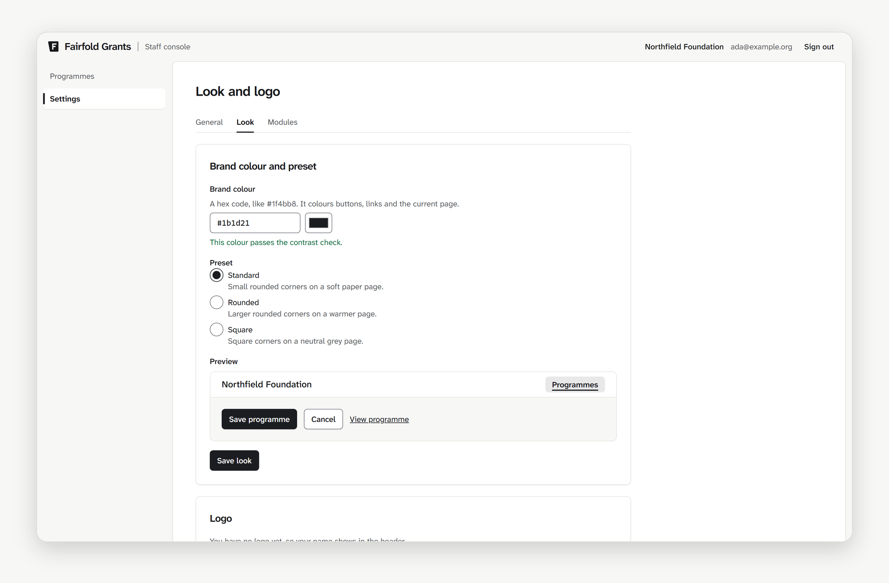
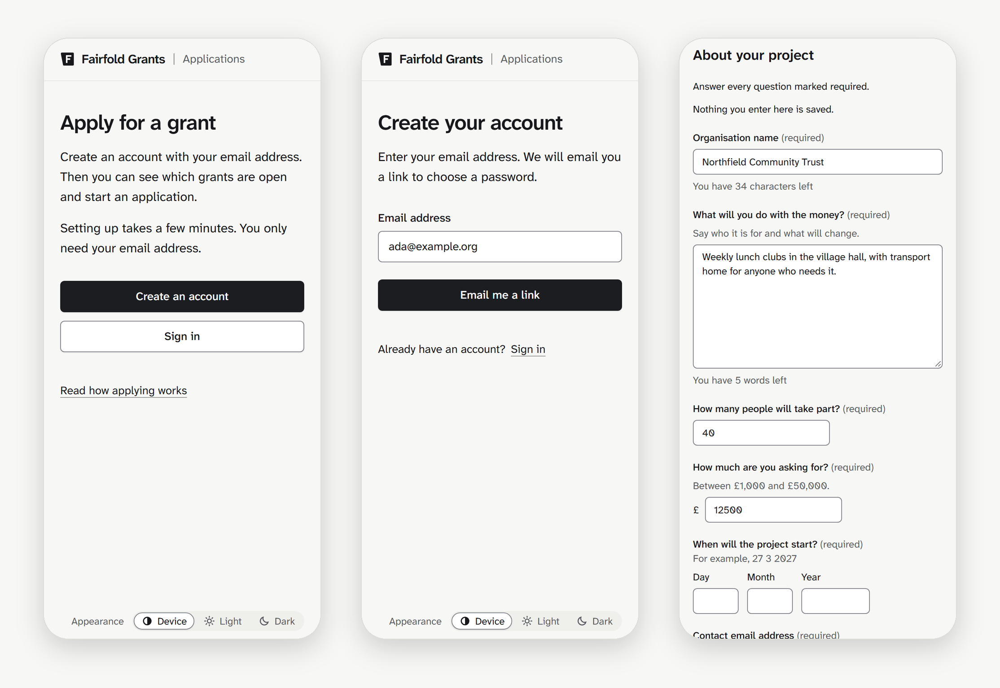

# Fairfold

The source code for **Fairfold**, an open source suite of tools for funders,
foundations and charities, made by The Pixel Scientists.

Each Fairfold tool stands on its own. An organisation can use just one, such
as Fairfold CRM or Fairfold Volunteers, or switch on several. Every tool runs
on the same shared platform: accounts and permissions, an audit log, one
record of the organisations and people it works with, and a data warehouse.
So an organisation that uses more than one tool enters each fact once.

## Status

**Fairfold Grants** is the first tool being built, with the shared platform
alongside it. It runs a funding round from start to finish: setting up a
programme, an applicant portal, eligibility checks, assessment, private
decisions, releasing outcomes, and exporting data, including to the
360Giving Data Standard. It is in development and not yet ready for real
data. The first milestone, a complete funding round on synthetic data, is
planned for the end of October 2026.

The other tools are planned, and the aim is for every tool to launch in
2027. Each has a placeholder folder in [`modules/`](modules) that says what
it will do.

## A first look

Fairfold Grants is ink on paper, set in
[Atkinson Hyperlegible Next](https://github.com/googlefonts/atkinson-hyperlegible-next),
with a light and a dark scheme that follow your device unless you choose
one. A funder's brand colour carries into both. These are real screens on
synthetic data, and the pictures follow your GitHub theme.

<picture>
  <source media="(prefers-color-scheme: dark)" srcset="docs/images/console-dark.webp">
  
</picture>

<picture>
  <source media="(prefers-color-scheme: dark)" srcset="docs/images/portal-dark.webp">
  
</picture>

Every screen of a funding round, built and still in design, is in the
[product book](https://fairfold.org.uk/book/).

## The Fairfold suite

| Tool | What it does | Status |
| --- | --- | --- |
| Fairfold Grants | Grant-making from programme set-up to releasing decisions and exporting data | In development |
| [Fairfold CRM](modules/crm) | Relationships, interactions and consent, built on the shared record of organisations and people | Shared record in development; full CRM planned for 2027 |
| [Fairfold Payments](modules/finance) | Grant payments, donations and money owed, through regulated payment providers | Planned for 2027 |
| [Fairfold Due Diligence](modules/assure) | Checks on applicants and grantees, from registry lookups to monitoring visits | Planned for 2027 |
| [Fairfold Impact](modules/impact) | Outcomes, indicators and evidence | Planned for 2027 |
| [Fairfold Governance](modules/governance) | Boards, board packs, decisions, risks, policies and incidents | Planned for 2027 |
| [Fairfold Activities](modules/dca) | A charity's own direct charitable activities, beside its grants | Planned for 2027 |
| [Fairfold Data Protection](modules/privacy) | Subject access, breaches, impact assessments and records of processing | Planned for 2027 |
| [Fairfold Integrations](modules/connect) | A plugin API and connections to other systems | Planned for 2027 |
| [Fairfold Field App](modules/field) | A mobile app for visits and work away from the office | Planned for 2027 |
| [Fairfold Recruitment](modules/people) | Fair recruitment, from advert to shortlist | Planned for 2027 |
| [Fairfold Forms](modules/forms) | Forms and surveys | Planned for 2027 |
| [Fairfold Reporting](modules/insight) | Reports for trustees and regulators from the shared warehouse | Planned for 2027 |
| [Fairfold Volunteers](modules/volunteers) | Recruiting, checking, scheduling and thanking volunteers | Planned for 2027 |
| [Fairfold Communications](modules/engage) | Newsletters, feedback and stories, with consent | Planned for 2027 |
| [Fairfold Fund Accounting](modules/funds) | Restricted funds, budgets and commitments | Planned for 2027 |
| [Fairfold Fundraising](modules/fundraising) | Supporters, donations and campaigns | Planned for 2027 |
| [Fairfold Bid Manager](modules/finder) | Finding funders and managing bids | Planned for 2027 |
| [Fairfold Case Management](modules/cases) | Casework for the people a charity supports | Planned for 2027 |
| [Fairfold Membership](modules/membership) | Members, subscriptions, events and CPD | Planned for 2027 |
| [Fairfold Assistant](modules/assist) | A governed assistant that leaves every decision to people | Planned for 2027 |
| [Fairfold Funding Map](modules/atlas) | Who funds what, and where | Planned for 2027 |
| [Fairfold Organisation Profile](modules/passport) | An organisation's details, given once and reused with every funder | Planned for 2027 |

## Repository layout

One repository holds the platform and every tool, as a pnpm workspace
([ADR 0016](docs/adr/0016-modular-suite-and-shared-warehouse.md)):

- **The platform**, which every tool uses and which is always on, is in
  `apps/` and `packages/`. The shared record of organisations, people,
  relationships and consent is an always-on module of its own,
  `modules/party`.
- **Each tool** is a module in `modules/<code name>/` that a tenant switches
  on or off, independently of the others. It owns its own database schema
  and reaches the platform and other tools only through published contracts.

| Path | Package | What it is |
| --- | --- | --- |
| [`apps/api`](apps/api) | `@pixel-scientists/api` | The API server and background jobs (Fastify) |
| [`apps/console`](apps/console) | `@pixel-scientists/console` | The staff and reviewer console (React) |
| [`apps/portal`](apps/portal) | `@pixel-scientists/portal` | The applicant portal (React) |
| [`packages/domain`](packages/domain) | `@pixel-scientists/domain` | Shared contracts: domain types, validation schemas and the route contracts every app is built on |
| [`packages/db`](packages/db) | `@pixel-scientists/db` | Database schema, SQL migrations, row-level security, tenant context and the field classification map |
| [`packages/ui`](packages/ui) | `@pixel-scientists/ui` | Accessible components, design tokens and the router shared by the console and portal |
| [`packages/config`](packages/config) | `@pixel-scientists/config` | The programme configuration schema and its validators |
| [`modules`](modules) | | One folder per tool, plus the shared record (`party`); the planned tools are placeholders |
| [`infra`](infra) | | Docker Compose services, container images and Semgrep rules |
| [`scripts`](scripts) | | Development, test and licence-check tooling |
| [`docs`](docs) | | Plans, architecture rules, decisions and style guides |

Built with TypeScript on Node.js 24, React, Fastify, Kysely and Zod, on
PostgreSQL 16 with row-level security, tested with Vitest and Playwright.
Everything runs on vanilla PostgreSQL in Docker, with no feature tied to one
cloud.

## Working on it

You need Node.js 24 (see `.node-version`), pnpm through Corepack, and Docker.

```bash
corepack enable
pnpm install
docker compose -f infra/compose/compose.dev.yaml up -d --wait
pnpm db:migrate
```

| Command | What it does |
| --- | --- |
| `pnpm check` | Types, lint, formatting, and unit and component tests |
| `pnpm test:db` | Database tests, including row-level security between tenants |
| `pnpm test:e2e` | Playwright end-to-end tests |
| `pnpm test:a11y` | Accessibility checks with axe |
| `pnpm db:migrate` / `pnpm db:rollback` | Apply or roll back migrations on your local database |
| `pnpm check:licences` | Check every dependency's licence against the policy |

## Documentation

- [V1 plan](docs/V1-PLAN.md): scope and acceptance criteria
- [Architecture rules](docs/ARCHITECTURE.md): the ten rules every change
  keeps, from tenant isolation to humans making every decision
- [Decisions](docs/adr): architecture decision records
- [Content style](docs/CONTENT-STYLE.md): how the interface is written
- [UI reference](docs/UI-REFERENCE.md): patterns and design tokens

## Contributing, security and licence

- [Contributing](CONTRIBUTING.md), including the Developer Certificate of
  Origin sign-off.
- [Security](SECURITY.md): report vulnerabilities privately.
- The code is licensed under the [GNU Affero General Public License
  v3.0 or later](LICENSE), and the documentation under
  [CC BY 4.0](LICENSE-docs). See [NOTICE](NOTICE).
